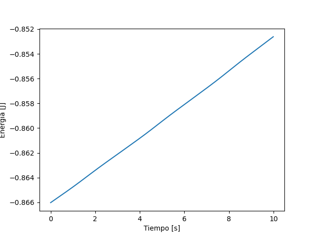
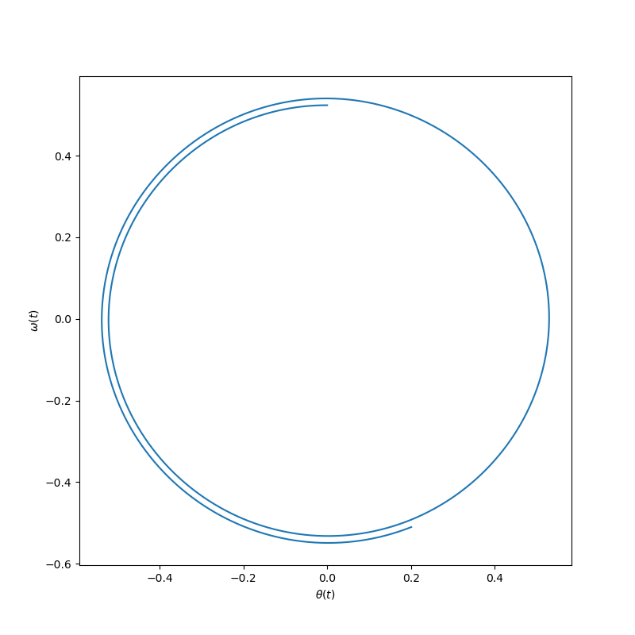
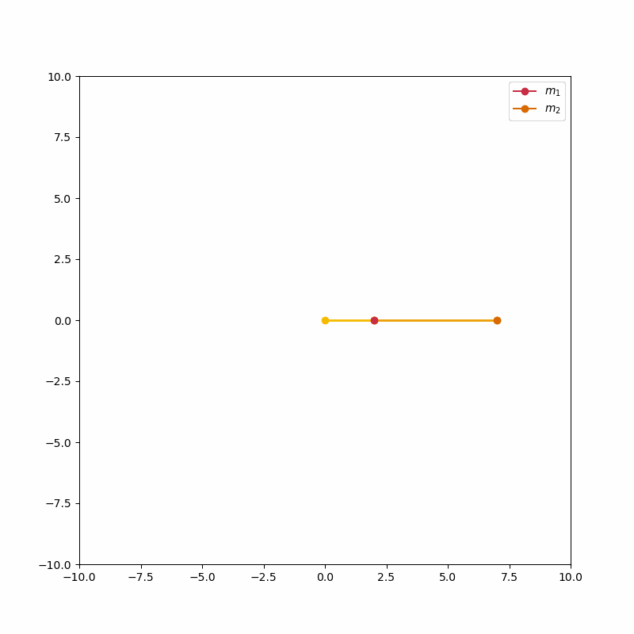

## **Ayudantía 10/10** -  *Física computacional II*

#### Métodos de Resoluciones de EDOs

### **Método de Euler:**
Definición analitica:
$x_{i+1} \approx  x_i + \Delta t \cdot f(x_i, i\Delta t)$

### **Método de Runge-Kutta**

$$
\begin{array}{rcl}
k_1 & = & hf(X_n , t_n) \\
k_2 & = & hf(X_n + \frac{1}{2}k_1, t_n + \frac{h}{2}) \\
k_3 & = & hf(X_n + \frac{1}{2}k_2, t_n + \frac{h}{2}) \\
k_4 & = & hf(X_n + k_3, t_n + h) \\
X_{n+1} & = & X_n + \frac{1}{6}(k_1 + 2k_2 + 2k_3 + k_4)
\end{array}
$$
### Péndulo simple: 

Para aplicar estos métodos al péndulo simple se deberá definir en un inicio el intervalo de la variable independiente ($t$), conjunto a la función vectorial y las condiciones iniciales de $\theta(0)$  y $\omega(0)$. 

```python
    t = dt*np.arange(0,N) # intervalos de tiempo 

    def f(x,t): #definicion funcion vectorial
        O, w = x
        return np.array([w, -np.sin(O)])

    x[0] = np.pi/6 , 0 #condiciones iniciales 
```

Finalmente aplicando el Método de Euler: 

```python
    for i in range(N-1): 
        x[i+1] = x[i] + f(x[i], i*dt)*dt 

    O = x[:,0] #funcion solucion (posicion, theta)
    w = x[:,1] #velocidad angular (omega)
```
Por otro lado **como es un sistema físico podremos estudiar la conservación de energía en el espacio de fase.** A partir de las expresiones de $\theta (t)$ y $ \omega (t)$ se podrán analizar propiedades físicas del sistema tal y como la energía. En donde se podrá obtener su expresión analítica:

$$
\begin{array}{rcl}
    \ddot{\theta} (t) + \frac{g}{l} sen (\theta (t)) &= 0 \\
    \dot{\theta} (t) \cdot \ddot{\theta} (t) + \dot{\theta} (t) \frac{g}{l} sen (\theta (t)) &=  0\\
    \frac{d}{dt} \left[ \frac{1}{2} \dot{\theta} (t)^2 - \frac{g}{l} cos(\theta (t)) \right] &=0 \\
\end{array}
$$

A partir de aca se definirá la energía como: 
$$
    \begin{array}{rcl}
        E &= \frac{1}{2} \dot{\theta} (t)^2 - \frac{g}{l} \cos(\theta (t)) \\
        E &= \text{constante}
    \end{array}
$$



Y en el espacio de fase: 



Ambas cosas nos indican que no se conserva la energía. 

#### *Para utilizar el Método Runge-Kutta deberán utilizar la definición propuesta, considerando la función vectorial la anteriormente definida. 

## **ACTIVIDAD!!!** Repita el procedimiento realizado para el péndulo simple considerando un **péndulo doble**. Las ecuaciones que describen a este sistema físico: 

$$
\begin{array}{rcl}
    (m_1 + m_2)l_1^2 \ddot{\theta}_1 + m_2 l_1 l_2 \ddot{\theta}_2 \cos(\theta_1 - \theta_2) + m_2 l_1 l_2 \dot{\theta}_2^2 \sin(\theta_1 - \theta_2) + (m_1 + m_2) g l_1 \sin(\theta_1) &= 0 \\
    m_2 l_2^2 \ddot{\theta}_2 + m_2 l_1 l_2 \ddot{\theta}_1 \cos(\theta_1 - \theta_2) - m_2 l_1 l_2 \dot{\theta}_1^2 \sin(\theta_1 - \theta_2) + m_2 g l_2 \sin(\theta_2) &= 0
\end{array}
$$
En donde es altamente conveniente trabajar las ecuaciones de movimiento por partes, es decir, llamarle, a la hora de definir la función en python, $\alpha$ a un par de términos parecidos, $\beta$ a otros y así, para evitar errores y bloat en el código (más elegancia y legibilidad en el código). 

**Nota:** Recuerde que tiene acceso al GitHub de Ayudantías donde puede encontrar material de apoyo para el curso. 

*Extra: Intente hacer una animación de esta situación física. Utilice ayuda de su Inteligencia Artificial de confianza para hacer la animación: 



*En este tipo de sistemas se puede observar la sensibilidad a las condiciones iniciales como en el siguiente gif, en donde se han graficado muchos péndulos dobles cuyas condiciones iniciales van iterando del modo $i* dt$ en un ciclo for.


El código para generar este gif se encuentra subido dentro del repositorio con el nombre many_pendulums.py el cual usted puede ejecutar y jugar con él. 

## Intente hacer usted el código antes de ver el de juguete
