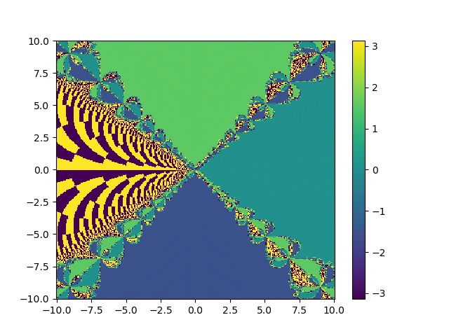

## **Ayudantía 14/11** -  *Física computacional II*
#### **Actividad :Erorr de método de Newton-Raphson en ceros múltiples (a mano)**
Encuentre el orden de error del método de Newton-Raphson cuado se encuentra un cero múltiple; para un cero múltiple se cumple que; 
$$ f(x^*) = f'(x^*) = 0 $$
Usando el algoritmo del método de la bisección, encuentre el error absoluto del método. Recuerde como funciona el método y lo que hace en cada iteración para derivar el error.
#### **Actividad: Fractal de Newton**


El fractal de Newton es una frontera en el plano complejo delimitada mediante el método de Newton aplicado a un polinomio fijo $p(Z) \in ℂ[Z]$. Es el conjunto de Julia  de la función meromorfa $\frac{p(z)}{p´(z)}$ que es el **conjunto de puntos donde la interacción con el método de Newton forma fronteras fractales entre las raíces. Para estudiarlos, partimos definiendo numéricamente nuestro método. 

```python
def Newton(f,h,x0,eps=1e-4): 
    n=0
    while np.abs(f(x0)/h(x0))> eps and np.abs(f(x0))>eps and n<30: 
        x0 = x0 - f(x0)/h(x0)  
        n= n+1
    return x0
```

Sabemos que para utilizarlo, debemos definir a una función y su derivada. Definamos una función polinomial: 

```python
l = lambda x: x**3 -1
dl = lambda x: 3*x**2
```
Notar que también pueden utilizar métodos numéricos para definir la derivada de la función $l$. En este caso lo haremos analiticamente y utilizaremos una función polinomial de grado 3: $l(x) = x^3 -1$.

Ahora, grafiquemos c:

Definamos nuestro espacio en el plano complejo $\mathbb{C}$ 


```python
re, im = np.mgrid[-10:10:300j, -10:10:300j] #ahi el j dice que tenga 10 elementos

x0 = re + 1j*im
```

Grafiquemos el fractal. Para hacerlo hay que tomar ciertas consideraciones. utilizamos "enumerate" ya que necesitamos guardar no solo el valor de cada elemento de x, sino que también necesitamos saber su posición.  Por lo que el indice nos dirá la posición y el valor nos indicará el valor.

```python
x = x0.copy()
for i, RE in enumerate(re): #le da un indice a cada uno de los elementos (indice, valor)
    for j,IM in enumerate(im): 
        x[i,j] = Newton(l,dl, x0=x0[i,j], eps=1e-4)


plt.scatter(x0.real, x0.imag)
plt.pcolor(x0.real, x0.imag, np.angle(x) )
# plt.scatter(x.real, x.imag, color='red')
plt.colorbar()
plt.show()
```

Obtenemos: 


